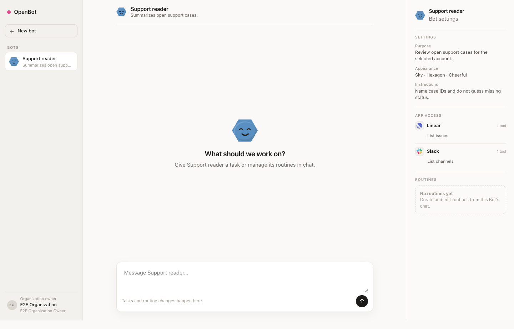
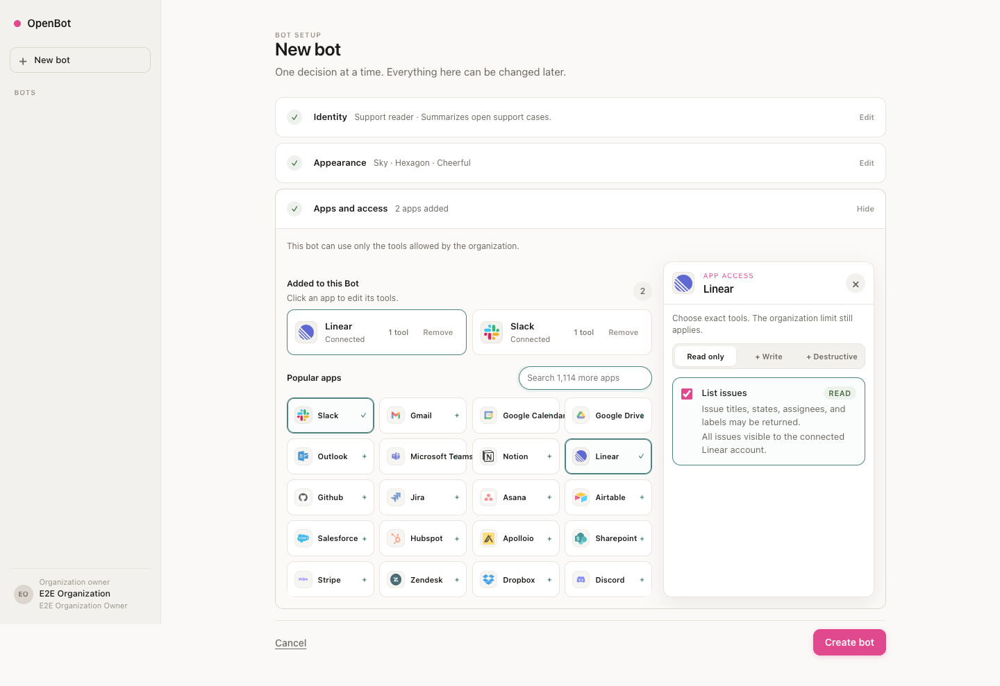

# OpenBot

OpenBot is an open source control plane for personal AI agents. A Bot is a chat. Connect apps once for your organization, choose the tools each Bot may use, then talk to it to run work and manage routines.



OpenBot is under active development. Do not connect production accounts or use real organization data yet.

## Create a Bot

Name the Bot, choose its appearance, and add the apps it needs. App access starts read-only. Write and destructive tools stay hidden until you open those levels. Clicking an added app opens its permission drawer; closing the drawer gives the catalog its full width again.



Organizations own app connections and set the maximum tool allowance. A Bot receives an explicit subset of that allowance. Tightening the organization limit removes the tool from every Bot.

## Work in chat

There is no separate task launcher or routine builder. Send a message with the up-arrow button. The agent can run the task or use an internal tool call to create and edit one or more routines. Existing routines appear in the chat sidebar.

Every run binds the exact app versions, tool policies, resource scopes, and connection references that were current when the message was handled. A connection identifies credentials. It does not grant authority by itself.

## Current status

The browser walkthrough now covers Bot creation, progressive app permissions, a task result, routine creation and editing, and organization permission changes. It records seven screenshots and a video on every run.

The build order and security contracts live in [PLAN.md](PLAN.md). Authentication, production persistence, vendor cleanup, runtime isolation, and release checks are not complete.

## Intended first release

- A React 19 client rendered from a narrow versioned page model and served by a Hono control plane on Cloudflare Workers
- TypeScript packages with Zod contracts and Drizzle repositories
- D1 as the first control database, followed by optional Hyperdrive-backed PostgreSQL and MySQL profiles after contract tests pass
- Better Auth magic links and organizations, with invitations, active membership, and owner/admin/member roles
- Metorial for OAuth connections, reviewed tool metadata, and run-owned filtered MCP sessions
- OpenRouter for one explicitly allowed model and provider with no fallback
- One SQLite-backed Durable Object per run for short-lived orchestration state
- One ephemeral Cloudflare Sandbox per code-enabled run, reached through a private sandbox runner with no OpenBot, provider, user, or storage credential in the container
- Append-only, hash-linked, redacted audit records with a documented database-administrator limitation

The first release excludes provider business-data writes, arbitrary MCP servers, interactive shell access, arbitrary command endpoints, package installation, browser control, persistent sandbox files, unattended routine execution, teams, direct Bot handoffs, and persistent conversation memory.

## Product shape

The main interface is a Bot roster, the active Bot's chat, and a settings rail for Bot configuration, app access, and routines. A message can request immediate work or manage a routine. The agent decides which internal tool to call. Routine edits rebind the routine to the Bot's current exact authority. Routine scheduling and unattended execution remain disabled. Each task creates an independent run and reserves a random run-owned Sandbox identity when code is enabled. Prior runs do not silently become model context.

The planned R2 artifact workspace is separate from the read-only core. It uses versioned collections and snapshot-bound Bot reads instead of a shared cloud computer. Artifact routes stay absent until their security and storage gate passes.

See [docs/product-ui.md](docs/product-ui.md) for the layout and route contract. OpenBot is not affiliated with xAI or Grok Bot. Third-party product research informed the interaction study, but OpenBot uses its own interface and security model.

## Architecture boundaries

OpenBot separates public requests, policy authority, vendor calls, and run state:

```text
browser
   |
   v
control plane ----> orchestrator ----> per-run Durable Object ----> capability gateway
                         |                                             |       |       |
                         | lifecycle                                   |       |       | execute
                         v                                             v       v       v
                   sandbox runner                                  Metorial OpenRouter sandbox runner
                         |                                                               |
                         +------------------------> per-run Sandbox <--------------------+
```

The public control plane cannot sign manifests or decrypt vendor capability references. The runtime has no public route, global database binding, vendor management key, Sandbox binding, browser, or reusable provider credential. The capability gateway reserves each model, provider-tool, or code call against current authority before dispatch. The sandbox runner owns the Sandbox namespace and never places an OpenBot, provider, user, or storage credential in the container.

These are design requirements, not claims that the controls are already implemented.

## Development

The pinned local verification entry point is:

```sh
corepack pnpm verify
```

`corepack pnpm test:integration` runs the local Worker RPC tests. Later database and preview checks use separate commands because they require Docker or disposable platform and vendor resources. Never substitute real organization data in a test account.

Run the real-app browser proof with:

```sh
corepack pnpm test:app:e2e
```

It opens the production React and Hono application in a headless browser, creates a Bot, adds two organization-scoped apps, and checks the progressive Read, Write, and Destructive permission views. Adding an app leaves the permission drawer closed. Clicking an added app opens it. The walkthrough sends a task in chat and reads the result, asks the Bot to create a routine, edits that routine from the sidebar, and changes the organization's permission ceiling.

The server-owned authority snapshot binds each opaque connection grant, provider version and specification, policy revision and digest, tool key and effect, and input and output schema digests. A separate session intent pins the configured Metorial API version and serializer identity. The private capability gateway must resolve opaque user grants to auth configs and serialize that intent for the pinned Metorial version. Authless and deployment-auth providers remain explicit modes.

Every run writes seven full-page screenshots and `openbot-product-flow.webm` under `test-results/app-e2e/walkthrough`. The HTML report at `playwright-report/index.html` includes the same attachments.

Authentication, storage, and task execution are bounded local substitutions; this command is not provider, model, production-database, or deployment evidence. On macOS it uses installed Google Chrome when available. Elsewhere, install Playwright Chromium or set `OPENBOT_E2E_CHROME_PATH` to a compatible browser executable.

The [Metorial catalog generator](docs/metorial-provider-catalog.md) builds a checked-in catalog from the pinned official integration source, Metorial's published current provider versions, and a reviewed top-20 theSVG icon manifest. The remaining published apps stay searchable. A server-side Metorial key is required only for the optional environment-specific SDK cross-check. Generated metadata never grants runtime access.

Read [CONTRIBUTING.md](CONTRIBUTING.md) before opening a change. Security reports belong in the private channel described in [SECURITY.md](SECURITY.md).

## License

Apache License 2.0. See [LICENSE](LICENSE).
